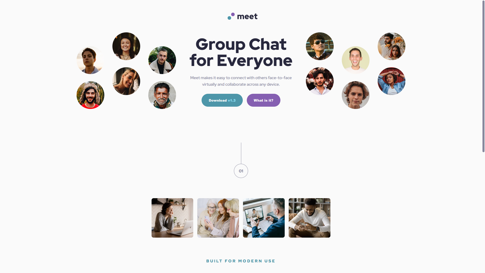
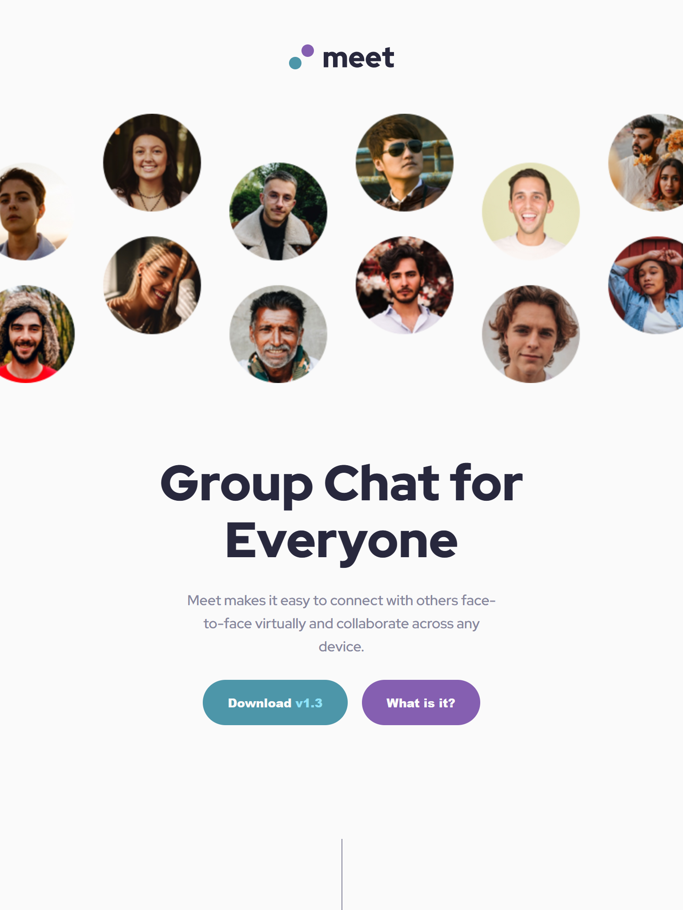
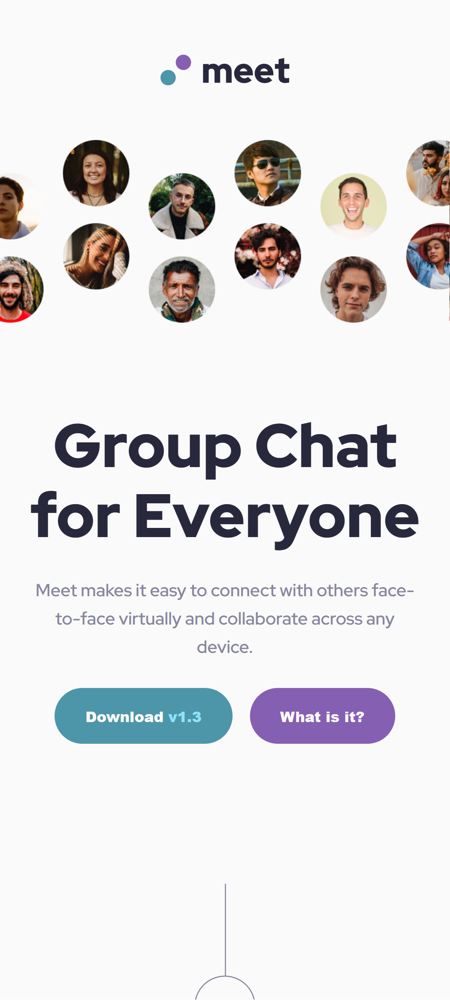

# Frontend Mentor - Meet landing page solution

This is a solution to the [Meet landing page challenge on Frontend Mentor](https://www.frontendmentor.io/challenges/meet-landing-page-rbTDS6OUR). Frontend Mentor challenges help you improve your coding skills by building realistic projects.

## Table of contents

- [The challenge](#the-challenge)
- [Screenshot](#screenshot)
- [Links](#links)

### The challenge

Users should be able to:

- View the optimal layout depending on their device's screen size
- See hover states for interactive elements

### Screenshots

### Links

- [Github Repo](https://github.com/ursasimenc/astro-meet-landing-page)
- [Demo](https://astro-meet-landing.netlify.app)

### Built with

- [Astro](https://astro.build) - Web framework
- [Sass](https://sass-lang.com/) - CSS preprocessor
